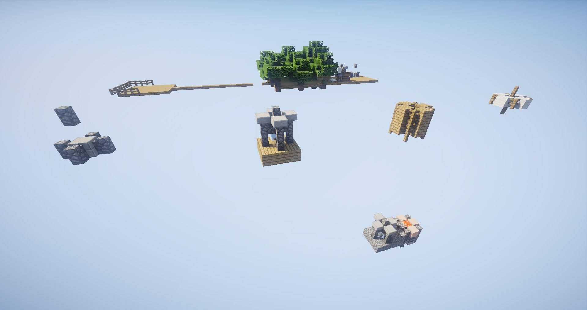

# 概览

## 1. 基本介绍

**SkyDream** 『**天之梦**』 是一款以多方块机器为核心的空岛生存科技插件，自带友好的任务书(SkyDream Guide)，能让玩家一步一步掌握这个插件的基本玩法。

通过神奇的多方块机器，玩家能从一块泥土一棵树的空岛发展成天空工厂。

<figure><figcaption>
SkyDream 天之梦
</figcaption></figure>

## 2. 科技线

**木器时代（已完成）—>石器时代（已完成）—>铁器时代（已完成）—**>蒸汽时代（中度）—>电力时代（未来可期）—>信息时代（遥遥无期）

## 3. 多方块机器

多方块机器是SkyDream的核心玩法。

SkyDream目前有3x3x3结构的普通多方块机器和5x5x5结构的多方块蒸汽机器，构建多方块机器需要使用**扳手**，按照任务书(SDGuide)上的路线就能一步一步制造出多方块机器！

使用扳手右击多方块结构最中间的方块即可构建多方块机器，右击其他地方无效。

## 4. 推荐一块泥土一棵树的空岛开局

<figure><figcaption>
一块泥土一棵树
</figcaption></figure>

SkyDream可以让玩家从一块泥土一棵树的空岛发展成天空工厂。

因此，无需安装刷矿插件，且自定义空岛时去除箱子，才能更好地食用本插件。
